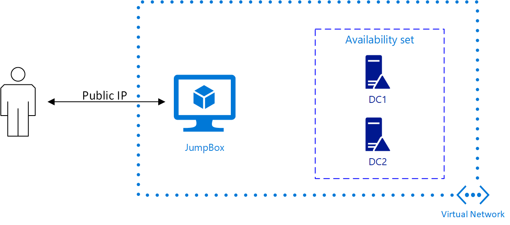

Core Virtual Network with Domain Controllers
---------------------------------------------

This template deploys a virtual network with two private domain controllers in an availbility set and a jump box for accessing the network:

<a href="https://transmogrify.azurewebsites.net/core-network/azuredeploy.json?environment=gov" target="_blank">
	
