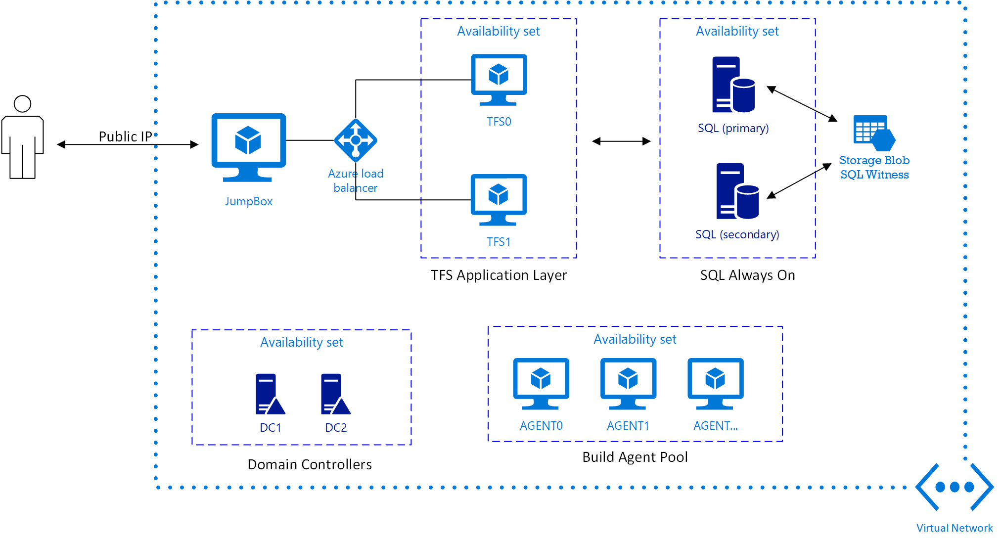

High Availability Team Foundation Server in Azure
--------------------------------------------------

This solution combined several other templates to deploy a high-availability [Team Foundation Server](https://www.visualstudio.com/tfs/) (TFS) in Azure. This solution is relevant for organizations where the SaaS [Vistual Studio Team Services](https://www.visualstudio.com/team-services/) (VSTS) is not an option. The deployed solution is outlined in the diagram below.

The components included are:

* [core-network](../core-network) which establishes a Virtual Network and sets up Domain Controllers.
* [sql-alwayson](../sql-alwayson) which sets up SQL server in Always On configuration.
* [tfs-ha](../tfs-ha) which sets up a high-availability deployment of TFS. 

In addition to this, some build agents are deployed.

Each of the components can be deployed on their own and for users that already have domain controllers established, they can simply specify a subnet and domain credentials to deploy SQL and TFS into those environments. This combined template is mostly provided as a way of testing the complete deployment. 

Since TFS establishes a web endpoint on the TFS servers, it is recommended that you secure that with SSL certificates. If you do not provide a certificate, a self-signed one will be generated. You can replace it after installation too. The way to provide it during deployment is through the `secrets` and `sslThumbprint` parameters. The `secrets` parameter is used to provide an array of certificates from [Azure Key Vault](https://azure.microsoft.com/en-us/services/key-vault/). The `sslThumbprint` parameter instructs the TFS installation script on which certificate to install. The repository includes a [convenience script](../scripts/PrepareDevnetTfsDeployment.ps1), which you can use to create a key vault to hold domain admin password and the SSL certificate. This script will create the key vault, upload all secrets, and generate a deployment parameters file with the details needed for deployment. 

Please consult the [tfs-ha](../tfs-ha) folder for more details including post-installation instructions, which include adding the established SQL databases to an availability group.

Deploy
------

Deploy this solution to either Azure Commercial or Azure Government:

<a href="https://transmogrify.azurewebsites.net/devnet-tfs-ha/azuredeploy.json?environment=gov" target="_blank">
	
